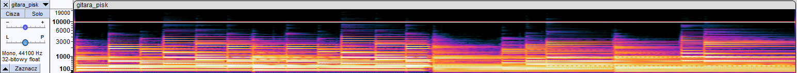

# Wstęp do Multimediów

Laboratorium 2 - Dźwięk

Bartłomiej Krawczyk, 310774

# 1. Analiza widma i spektrogramu dźwięków

### 1. Pojedyncze tony
- Wygeneruj ton o częstotliwości 1000 Hz i amplitudzie 0,5
- Wyświetl widmo sygnału (Analizuj - Narysuj widmo) i sprawdź, jaki wpływ na wygląd widma ma zmiana rozmiaru okna analizy widmowej (Rozmiar: …)
- Sprawdź, jaki wpływ na widmo sygnału ma rodzaj zastosowanego okna (Funkcja: …)

Wykresy widma, w zależności od rozmiaru okna analizy dla funkcji `Hann okno`:

| Rozmiar | 128                     | 512                     | 2048                     | 8192                     |
|---------|-------------------------|-------------------------|--------------------------|--------------------------|
| Widmo   |  |  |  |  |

> Sprawdź, jaki wpływ na wygląd widma ma zmiana rozmiaru okna analizy widmowej

Im większy rozmiar okna tym wykres jest bardziej skupiony w pobliżu 1 kHz.

Dla mniejszych okien widoczne jest `rozlewanie` widma na pozostałe częstotliwości.

---

Wykresy widma, w zależności od zastosowanego okna analizy dla rozmiaru `1024`:

| Funkcja | Prostokątne okno              | Okno Hamminga               | Okno Hanna               | Okno Blackmana-Harrisa              | Okno Gaussa (a=3,5)           |
|---------|-------------------------------|-----------------------------|--------------------------|-------------------------------------|-------------------------------|
| Widmo   |  |  |  |  |  |

> Sprawdź, jaki wpływ na widmo sygnału ma rodzaj zastosowanego okna (Funkcja: …)

Rodzaj zastosowanego okna także wpływa na poziom `rozlewania` się widma na pozostałe częstotliwości.

Prostokątne okno na sztywno wycina sygnał, przez co osiąga tutaj najbardziej rozlany wykres.

Funkcje Hanna, Blackmana-Harrisa oraz Gaussa lepiej sobie radzą z tym sygnałem.

---

- Klikając czarny trójkąt przy nazwie ścieżki zmień widok na „Spektrogram”
- Zaobserwuj, jak wygląda spektrogram dla wygenerowanego tonu (pojedynczej częstotliwości)

> Zaobserwuj, jak wygląda spektrogram dla wygenerowanego tonu (pojedynczej częstotliwości)

Na spektrogramie widać jedną linię skupioną wokół stałej częstotliwości 1 kHz.

---

- Wygeneruj kolejny ton (będąc „odklikniętym” z poprzedniej ścieżki), o częstotliwości 2000 Hz i amplitudzie 0,3

- Zaznacz obie ścieżki i w menu wybierz Ścieżki – Miksuj – Miksuj i renderuj
- Zaobserwuj, jak wygląda spektrogram

> Zaobserwuj, jak wygląda spektrogram

Na spektrogramie widać dwie linie:
- `jaśniejszą` skupioną wokół stałej częstotliwości 1 kHz
- `ciemniejszą` skupioną wokół stałej częstotliwości 2 kHz

### 2. Dźwięki muzyczne

- Zaimportuj ścieżkę „flet.wav”
- Posłuchaj i wyświetlając widmo sygnału, sprawdź, jaka jest częstotliwość dźwięku, który gra flecistka
- Zaobserwuj, jak wygląda na spektrogramie dźwięk instrumentu muzycznego – zwróć uwagę na występowanie wielu częstotliwości harmonicznych (wielokrotności częstotliwości podstawowej)

> Sprawdź, jaka jest częstotliwość dźwięku, który gra flecistka

Flecistka gra dźwięk o częstotliwości podstawowej równej `444 Hz`.

> Zaobserwuj, jak wygląda na spektrogramie dźwięk instrumentu muzycznego.

Na wykresie widać jeden duży pik ok. częstotliwości `444 Hz` oraz wiele coraz to mniejszych w wielokrotnościach wartości 444 Hz.

Także na przedziale 0 Hz - 150 Hz znajduje się pomniejszy blob bez dobrze widocznego piku.

---

- Zaimportuj ścieżkę „oboj_piano.wav” oraz osobno „oboj_forte.wav”
- Posłuchaj kolejno każdej ze ścieżek i zobacz na spektrogramie, w jaki sposób różnica w barwie dźwięku pomiędzy instrumentem grającym `cicho (piano)` i `głośno (forte)` widoczna jest na spektrogramie

> Zobacz na spektrogramie, w jaki sposób różnica w barwie dźwięku pomiędzy instrumentem grającym cicho (piano) i głośno (forte) widoczna jest na spektrogramie

Spektorgram głośniejszy w porównaniu do cichszego:
- jest jaśniejszy
- widać więcej granych częstotliwości
- te "dodatkowe" widoczne sygnały są o wyższych częstotliwościach

---

- Zaimportuj ścieżkę „waltornia.wav”
- Zmień pionową skalę spektrogramu z liniowej na logarytmiczną (kliknięcie prawym przyciskiem myszy na skali po lewej stronie wykresu) i słuchając nagrania zobacz, jak na spektrogramie widoczna jest melodia, którą gra waltornista.

> Zobacz, jak na spektrogramie widoczna jest melodia, którą gra waltornista.

Na spektrogramie widoczne są momenty w których muzyk gra coraz to wyższą melodię - spektrogram pokazuje grane wyższe częstotliwości ("przesuwa grane sygnały w górę").

Między wdechami słychać i widać charakterystyczny dźwięk.

### 3. Mowa
- Zaimportuj ścieżkę „mowa_mezczyzna.wav” oraz osobno „mowa_kobieta.wav”
- Na podstawie widma obu sygnałów przeanalizuj, w jakich zakresach częstotliwości więcej energii ma dźwięk mowy męskiej, a w jakich mowy kobiecej (lepiej będzie to widać ustawiając liniową skalę poziomą wykresu)

| Mowa  | Mężczyzny             | Kobiety               |
|-------|-----------------------|-----------------------|
| Widmo |  |  |

> Na podstawie widma obu sygnałów przeanalizuj, w jakich zakresach częstotliwości więcej energii ma dźwięk mowy męskiej, a w jakich mowy kobiecej.

Dźwięk mowy męskiej ma więcej energii w niższych częstotliwościach - `[0 Hz - 4 kHz)`

Dźwięk mowy kobiecej jest bardziej zrównoważony na wszystkich osiąganych częstotliwościach i osiąga wyższą energię na przedziałach - `[4 kHz - 12 kHz]`.

# 2. Edycja dźwięków

### 1. Mowa
- Otwórz ścieżkę „mowa_kobieta.wav” oraz osobno „mowa_mezczyzna.wav”
- Zastosuj filtrację górnoprzepustową (zaznacz ścieżkę, Efekt – Filtr górnoprzepustowy) do ścieżki z mową kobiecą, tj. odfiltruj dolne częstotliwości dźwięku, stosując ustawienia: częstotliwość graniczna 200 Hz, rolloff 24 dB/oktawę
- Zobacz różnicę w widmie przed i po filtracji. Posłuchaj ścieżki mowy kobiecej po filtracji – czy utracona została jakaś istotna część sygnału?

| Mowa Kobiety | Przed                 | Po filtracji górnoprzepustowej |
|--------------|-----------------------|--------------------------------|
| Widmo        |  |           |

> Zobacz różnicę w widmie przed i po filtracji.

Zniknęły niskie częstotliwości mowy kobiecej.

> Czy utracona została jakaś istotna część sygnału?

Nie słychać większej zmiany w mowie kobiety. Utracona część nie była bardzo istotna.

- Zastosuj taką samą filtrację górnoprzepustową (te same parametry), do mowy męskiej. Zaobserwuj widmo przed i po filtracji. Posłuchaj ścieżki mowy męskiej – czy przy filtracji utracona została istotna część sygnału w porównaniu do mowy kobiecej?

| Mowa Mężczyzny | Przed                 | Po filtracji górnoprzepustowej |
|----------------|-----------------------|--------------------------------|
| Widmo          |  |           |

>  Zaobserwuj widmo przed i po filtracji.

Tutaj także utracono niskie częstotliwości mowy.

> Czy przy filtracji utracona została istotna część sygnału w porównaniu do mowy kobiecej?

W przypadku mowy męskiej różnica między nagraniami jest słyszalna.

Energia w mowie męskiej jest skupiona na niższych częstotliwościach. Odfiltrowując te częstotliwości tracimy całkiem istotną część mowy.

--- 

- Do mowy kobiecej zastosuj dodatkowo filtrację dolnoprzepustową, tj. odfiltruj wysokie częstotliwości sygnału, stosując ustawienia np: 8 000 Hz, 24 db/okt
- Stosując różne wartości częstotliwości granicznej filtru, sprawdź, przy jakiej częstotliwości utracona zostaje wyrazistość mowy, a przy jakiej zrozumiałość.

> Sprawdź, przy jakiej częstotliwości utracona zostaje `wyrazistość` mowy

Wyrazistość mowy zostaje utracona przy częstotliwości ok. 5 kHz

> Sprawdź, przy jakiej częstotliwości utracona zostaje `zrozumiałość` mowy

Zrozumiałość mowy zostaje utracona przy częstotliwości ok. 750 Hz

### 2. Eliminacja zakłóceń

- Zaimportuj ścieżkę „ton_trzaski.wav” i posłuchaj – w nagraniu znajduje się ton i zakłócenia (trzaski)
- Przełącz widok ścieżki na spektrogram, zaobserwuj występowanie trzasków, które nie były widoczne na przebiegu czasowym sygnału.

---

- Ponownie rozwiń menu przy nazwie ścieżki. Włącz „Ustawienia spektrogramu”.
- Sprawdź, jak rozmiar okna analizy fft wpływa na wygląd spektrogramu. Zmieniaj po kolei rozmiar okna z 1024 na coraz mniejsze, a później coraz większe i zobacz, który rozmiar jest najlepszy dla uzyskania największej rozdzielczości w dziedzinie czasu (pozioma oś), a który zapewnia najlepszą rozdzielczość w dziedzinie częstotliwości (pionowa oś).

| Rozmiar okna | Spektrogram                     |
|--------------|---------------------------------|
| 128          |          |
| 256          |          |
| 1024         |  |
| 2048         |         |
| 4096         |         |
| 8192         |         |
| 32768        |        |

> Który rozmiar jest najlepszy dla uzyskania największej rozdzielczości w dziedzinie czasu (pozioma oś)?

Im mniejszy rozmiar okna tym lepsza rozdzielczość uzyskana w dziedzinie czasu.

Najlepszy efekt uzyskałem dla okna o rozmiarze `256`. Dobrze rozróżnialne są wszystkie trzaski oraz wszystkie serie po 3 są widoczne na spektrogramie. 

Dla niższych rozmiarów część trzasków nie jest widoczna, a także częstotliwości się rozlewają na większość wykresu.

> Który zapewnia najlepszą rozdzielczość w dziedzinie częstotliwości (pionowa oś)?

Im większy rozmiar okna tym lepsza rozdzielczość w dziedzinie czasu.

Oczywiście najbardziej skupiona wiązka 3kHz jest na spektrogramie z największym rozmiarem okna.

Jednakże dla wyższych częstotliwości tracimy informację o czasie i zlewają w konsekwencji zlewają nam się trzaski.

Złotym środkiem preferującym rozdzielczość częstotliwości (ale pozostawiającym część informacji o czasie) jest rozmiar okna równy `2048`.

---

- Przy optymalnych ustawieniach okna analizy dla widoczności trzasków (których czas trwania jest bardzo krótki) spróbuj usunąć zakłócenia w następujący sposób:
    1. W widoku spektrogramu zaznacz fragment, w który występuje trzask
    2. Przełącz widok na przebieg czasowy
    3. W menu wybierz Zaznacz – Na miejscach przejść przez zero (to pozwoli uniknąć nieciągłości sygnału na krańcach zaznaczenia)
    4. Usuń zaznaczony fragment (pojedynczy trzask) naciskając delete
    5. Posłuchaj nowej wersji ścieżki

---

- Zaimportuj ścieżkę „gitara_pisk.wav”
- Zaobserwuj na spektrogramie, jakiego rodzaju zakłócenie występuje w tym nagraniu i spróbuj je usunąć w następujący sposób:
    1. Zaznacz odpowiedni fragment spektrogramu (dany zakres częstotliwości w całym czasie trwania zakłócenia)
    2. Spróbuj usunąć zakłócenie używając filtra notch (Efekt – Filtr Notch) o odpowiednich parametrach
    3. Posłuchaj nowej wersji ścieżki

> Zaobserwuj na spektrogramie, jakiego rodzaju zakłócenie występuje w tym nagraniu

Przez cały czas grania utworu w tle słychać dźwięk o stałej częstotliwości 10 kHz.

# 3. Lateralizacja źródła dźwięku

- Do tego zadania niezbędne są słuchawki!
- Zaimportuj ścieżkę „lektor.wav”
- Zaznacz zaimportowaną ścieżkę i powiel ją (Edycja – Powiel)
- Jedną ze ścieżek ustaw w panoramie (suwak L – P pod nazwą ścieżki) na prawo, a drugą na lewo
- Kliknij kursorem w jakieś miejsce ścieżki, gdzie amplituda sygnału jest duża
- Klikając „lupkę” przybliż przebieg czasowy tak, aby na skali były tysięczne części sekundy
- Zmień typ kursora na poziomą podwójną strzałkę (↔)
- Przesuń jedną ze ścieżek w prawo lub w lewo o tysięczne części sekundy
- Posłuchaj, jak po przesunięciu zmienia się położenie pozornego źródła dźwięku
- Jeśli przesuniesz ścieżkę o zbyt dużą wartość, zniknie wrażenie przesuwania się źródła dźwięku, a powstanie wrażenie „echa”

Dźwięk słyszalny z lewej strony:

Dźwięk słyszalny z prawej strony:

> Posłuchaj, jak po przesunięciu zmienia się położenie pozornego źródła dźwięku.

Źródło dźwięku wydaje się znajdować po stronie ucha do którego prędzej dociera fala dźwiękowa.

# 4. Próbkowanie i kwantyzacja
- zaimportuj pliki "drums_sweep.wav", "drums_sweep_convert_Fs11025Hz.wav" i "drums_sweep_convertFs11025Hz_filtering.wav"
- posłuchaj i oceń brzmienie każdego pliku (drugi z nich to konwersja z fs = 44 100 Hz na 11 025 Hz bez odpowiedniej filtracji sygnału, a trzeci to konwersja z 44 100 Hz na 11 025 Hz, ale z włączoną filtracją anty-aliasingową),
- posłuchaj, czy słyszysz składowe, które nie występowały w oryginalnym sygnale?
- zobaczyć na spektrogramie w jaki sposób wygląda aliasing na granicy pasma.

> Posłuchaj i oceń brzmienie każdego pliku?

Generalnie początek utworu brzmi identycznie dla każdego pliku.

Dopiero różnią się pod koniec gdy zanika dźwięk o wzrastającej częstotliwości.

Wszystkie pliki brzmią całkiem dobrze.

> Posłuchaj, czy słyszysz składowe, które nie występowały w oryginalnym sygnale?

W pliku `drums_sweep_convert_Fs11025Hz.wav` pod koniec słyszalna jest dodatkowa składowa o spadkowej częstotliwości.

> Zobaczyć na spektrogramie w jaki sposób wygląda aliasing na granicy pasma.

Dźwięk o wzrastającej częstotliwości powyżej częstotliwości odcinanej jest odbijany na granicy:

---

- zaimportuj pliki "drums.wav", "drums_8bits.wav" i "drums_8bits_dith1.0.wav"
- posłuchaj i oceń wybrzmiewanie uderzenia stopy i werbla oraz brzmienia talerzy po kwantyzacji do 8 bitów
- posłuchaj i oceń wybrzmiewanie uderzenia stopy i werbla oraz brzmienia talerzy po kwantyzacji do 8 bitów, ale z dodaniem sygnału dither'a. Czy odzyskało wybrzmienie, ale kosztem mniejszego SNR?
- obejrzyj i porównaj spektrogramy każdego sygnału (najlepiej ustawienia: Gain-0dB, Range120dB, Max Freq-22000Hz, Windows size - 4096, Windows type: Blackman Harris)

> Oceń wybrzmiewanie uderzenia stopy i werbla oraz brzmienia talerzy po kwantyzacji do 8 bitów.

Samo brzmienie nie jest bardzo pogorszone, ale słychać częściowe zakłócenia pomiędzy uderzeniami.

Brzmienie stopy wydaje się bardziej wyraźne niż talerzy.

> Oceń wybrzmiewanie uderzenia stopy i werbla oraz brzmienia talerzy po kwantyzacji do 8 bitów, ale z dodaniem sygnału dither'a.

Tym razem oba dźwięki wydają się brzmieć wyraźnie, jednak słychać ciągły szum.

> Czy odzyskało wybrzmienie, ale kosztem mniejszego SNR?

Tak wybrzmienie jest wyraźniejsze, ale jest także ciągle słyszalny szum.

> Porównaj spektrogramy każdego sygnału.

Na spektrogramie `drums_8bits.wav` względem pierwszego spektrogramu widać, że powstał nierównomierny szum.

Na spektrogramie `drums_8bits_dith1.0.wav` względem pierwszego spektrogramu widać dodany równomierny szum - w każdym momencie szum jest taki sam, przez co dźwięk utworu wydaje się wyraźniejszy.