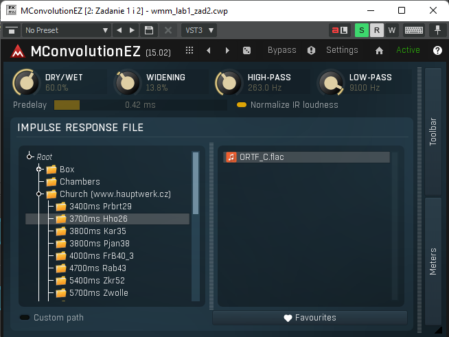
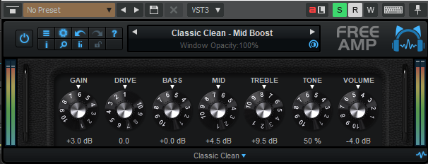

# Wstęp do Multimediów

Laboratorium 3 - Dźwięk

Bartłomiej Krawczyk, 310774

# Filtracja

# Punkt 1 - 2
Wzmocnienie o 6dB zakres częstotliwości od 3500Hz w górę:
- filtr High-shelf
- 3500 Hz
- + 6.0 dB

Wycięcie zakresu częstotliwości poniżej 80 Hz:
- filtr High-pass
- 80 Hz
- 0.71
- ze slope równym 3

Efekt:

# Punkt 3 - 4

Wytłumienie zakresu częstotliwości wokół 210 Hz:
- filtr Peak
- Q ustawione na 10
- -24 dB

Skutecznie zniwelowało to nieprzyjemne brzmienie.

Efekt:

# Cyfrowe procesory dźwięku

# Pogłos

# Punkt 1

Włączono podany efekt:

# Punkt 2
Efekt Vocal Room:

Efekt Big Vocal Hall:

Porównując oba efekty pogłosu:
- słowa nie są tak dobrze rozpoznawalne między sobą korzystając z `Big Vocal Hall`

# Punkt 3

Aby dostosować ścieżkę chóru zastosowałem `Church - 3700ms Hho26 - ORTF_C.flac`

# Kompresja Dynamiki

# Punkt 1

Po włączeniu efektu słychać głośniej ciche fragmenty perkusji.

# Punkt 2

Bez efektu:

Z efektem:

# Symulacja dźwięku przestrzennego 3D

# Punkt 1

Ustawiłem parametry zgodnie z zaleceniami:

Wrażenia:
- bez problemu jestem w stanie określić z którego miejsca dobiega dźwięk
- wartość elewacji modyfikowała położenie źródła dźwięku w pionie
- wartość azymutu ustalała o jaki kąt obrócić wokół głowy źródło dźwięku

# Punkt 2

Parametry procesora dźwięku `dearVR MICRO`:
- **Azimuth** 
    - ilość stopni rotacji źródła dźwięku wokół słuchacza
    - podczas zmiany tego parametru słychać jak dźwięk obraca się wokół głowy
- **Elevation**
    - ilość stopni wysokości źródła dźwięku w trzy wymiarowej przestrzeni
    - podczas zmiany tego parametru źródło dźwięku wydaje się przesuwać odpowiednio w dół oraz w górę
- **Width**
    - kontroluje dystans między lewym i prawym kanałem
    - ta opcja nie jest dostępna dla monotonicznego wejścia
    - mała wartość powoduje skupienie dźwięku w jednym punkcie
    - duża wartość powoduje rozmycie źródła dźwięku na większą przestrzeń
- **Focus**
    - to ustawienie pozwala dobrać odpowiedni stosunek sygnału oryginalnego i sygnału przetworzonego
    - ustawiając na niewielkie wartości nie słychać zmian przy przemieszczaniu źródła dźwięku
    - ustawiając na bardzo duże jesteśmy w stanie bardzo dobrze wykryć źródło dźwięku
- **Reflections**:
    - poziom odbić dźwięku od ścian pomieszczenia w kształcie pudełka po butów
    - **Level** - ustawia o ile wzmocnić dźwięk odbicia
    - **Size**
        - ustalenie wielkości symulowanego pomieszczenia
        - większy rozmiar powoduje późniejsze dotarcie odbicia
    - **Room**
        - pozwala wybrać z jakiego rodzaju materiału powinny być wykonane symulowane ściany
        - różne rodzaje ścian absorbują różne częstotliwości

# Synteza i MIDI

# Punkt 1

# Punkt 2

Zmiana kształtu obwiedni:

Po modyfikacji obwiedni słychać jak zmienia się dodatkowy pulsujący dźwięk.

Ciężko jest opisać obserwowaną zmianę.

# Punkt 3

Zastosowałem jeden z dostępnych ustawień predefiniowanych.

# Punkt 4

Dołożyłem dodatkowe `klocki`:

# Punkt 5

Modyfikowałem parametry oraz skorzystałem z predefiniowanych ustawień:

Ścieżka grana sama wydaje się zawierać, jednakże grana razem z zastosowaniem modyfikacji wyraźnie wpływa na  charakter utworu.

# Punkt 6

Zastosowałem kompresor dynamiki (który powinien spowodować, że ciche fragmenty powinny stać się dużo głośniejsze):

Dodałem własną "melodię" za pomocą układania klocków:

Po skomponowaniu utworu dochodzę do wniosku, że nie mam wyczucia muzycznego. Stworzona melodia to bardziej losowe dźwięki grane razem, niż melodia.
