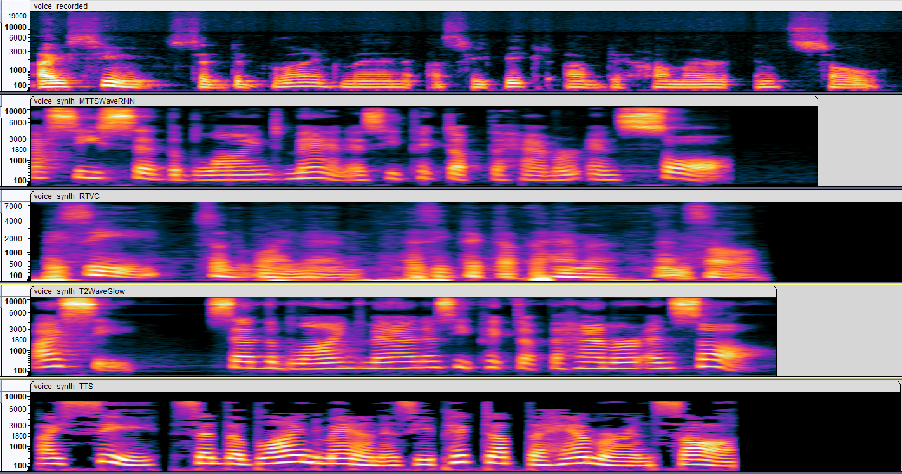

# Wstęp do Multimediów

Laboratorium 3 - Dźwięk

Bartłomiej Krawczyk, 310774

# Synteza mowy - TTS

## Porównanie Algorytmów

|                                 | Real-Time Voice Cloning                                     | Google TTS                                               | Tacotron2 + Waveglow                   | Mozilla TTS                            |
|---------------------------------|-------------------------------------------------------------|----------------------------------------------------------|----------------------------------------|----------------------------------------|
| Ocena (1-najlepiej 4-najgorzej) | 4                                                           | 3                                                        | 1                                      | 2                                      |
| Głos                            | Stary mężczyzna                                             | Mężczyzna                                                | Kobieta                                | Kobieta                                |
| Opinia                          | Nie przypomina głosu na podstawie którego był syntetyzowany | Słychać charakterystyczny dla syntetyzatorów mowy pogłos | Głos ciężko rozróżnić od głosu kobiety | Głos ciężko rozróżnić od głosu kobiety |

## Spektrogramy

**Wypowiadany tekst:**
```
“I see,” said the blind man as he picked up the hammer and saw.
```



## Wnioski

- takie same słowa wypowiadane przez różne syntezatory wyglądają na spektrogramach bardzo podobnie
- możliwe jest rozpoznanie poszczególnych słów na spektrogramach

# Rozpoznawanie mowy - STT

**Wypowiadany tekst:**
```
Time flies like an arrow, but fruit flies like a banana.
```

**CMUSphinx:**
```
time flies like an arrow but for flies like a diamond
```

**Google:**
```
time flies like an arrow but fruit flies like a banana
```

**Mozilla DeepSpeech:**
```
time five by an arrow but truly like a banana
```
