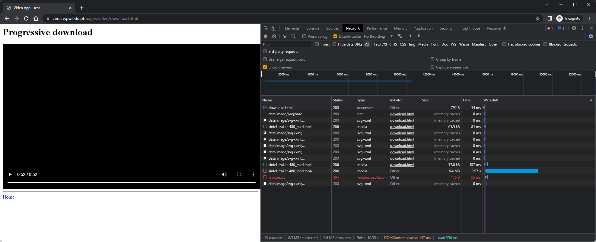
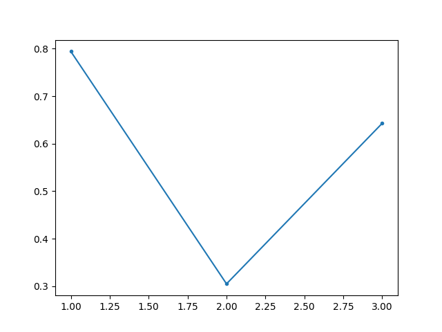
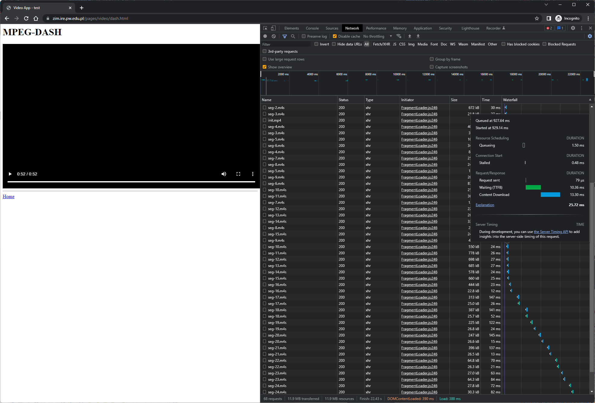
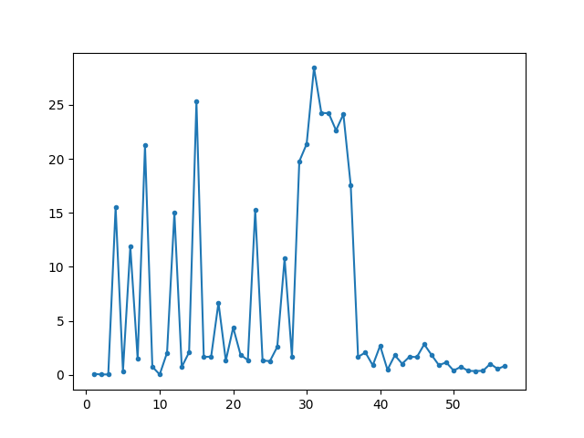

# WMM - Lab. 6 - Strumieniowanie danych multimedialnych



# 1. Transmisja danych multimedialnych z wykorzystaniem protokołu HTTP

| url                                                                    | timestamp_ms | elapsed_ms         | size_kb  |
|------------------------------------------------------------------------|--------------|--------------------|----------|
| https://zim.ire.pw.edu.pl/pages/video/video/sintel-trailer-480_med.mp4 | 135          | 82.05599999928381  | 65.172   |
| https://zim.ire.pw.edu.pl/pages/video/video/sintel-trailer-480_med.mp4 | 217          | 185.83699999993505 | 56.674   |
| https://zim.ire.pw.edu.pl/pages/video/video/sintel-trailer-480_med.mp4 | 381          | 9974.043999998685  | 6413.666 |

> Jakie komunikaty protokołu HTTP zostały użyte podczas transmisji?

Użyte zostały komunikaty `GET`.

W nagłówku `Content-Range` znajduje się informacja, która część filmu w formacie mp4 została pobrana.

> Oszacować średnią i maksymalną przepływność strumienia danych podczas transmisji pliku multimedialnego



Plik `sintel-trailer-480_med.mp4` pobierany był 3 razy. 

Pierwsze 2 pliki są niewielkimi fragmentami filmu (65kB i 57kB).

Trzeci fragment to pozostała część filmu (6414kB).

**Maksymalna przepływność:**
```
0.794238081 MB/s
```

**Średnia przepływność:**
```
0.580746642 MB/s
```

> Na podstawie analizy kodu źródłowego dokumentu HTML z pkt. 2 określić jakie elementy języka HTML5 zostały wykorzystane do odtworzenia pliku multimedialnego. 

Wykorzystany element to `<video>`.

> Czy umożliwiają one odtwarzanie dowolnych formatów danych multimedialnych?

Element ten wspiera różne formaty oraz kodeki, jednak obsługa danego formatu zależy od wykorzystywanej przeglądarki.

Oznacza to, że nie jesteśmy w stanie odtwarzać **dowolnych** formatów danych multimedialnych.

# 2. Adaptacyjne strumieniowanie danych multimedialnych z wykorzystaniem standardu MPEG-DASH



| url                                                                                      | timestamp_ms | elapsed_ms         | size_kb  |
|------------------------------------------------------------------------------------------|--------------|--------------------|----------|
| https://zim.ire.pw.edu.pl/pages/video/video/sintel-trailer-480_dash/video/2/init.mp4     | 429          | 16.228999997110805 | 0.733    |
| https://zim.ire.pw.edu.pl/pages/video/video/sintel-trailer-480_dash/audio/und/init.mp4   | 430          | 14.577000001736451 | 0.631    |
| https://zim.ire.pw.edu.pl/pages/video/video/sintel-trailer-480_dash/video/2/seg-1.m4s    | 455          | 27.739999997720588 | 430.526  |
| https://zim.ire.pw.edu.pl/pages/video/video/sintel-trailer-480_dash/audio/und/seg-1.m4s  | 458          | 58.03300000115996  | 20.909   |
| https://zim.ire.pw.edu.pl/pages/video/video/sintel-trailer-480_dash/video/2/seg-2.m4s    | 501          | 21.950999998807674 | 260.707  |
| https://zim.ire.pw.edu.pl/pages/video/video/sintel-trailer-480_dash/audio/und/seg-2.m4s  | 523          | 17.31099999960861  | 25.622   |
| https://zim.ire.pw.edu.pl/pages/video/video/sintel-trailer-480_dash/video/3/seg-2.m4s    | 536          | 31.64200000173878  | 671.703  |
| https://zim.ire.pw.edu.pl/pages/video/video/sintel-trailer-480_dash/audio/und/seg-3.m4s  | 544          | 28.333999998721993 | 21.412   |
| https://zim.ire.pw.edu.pl/pages/video/video/sintel-trailer-480_dash/video/3/init.mp4     | 571          | 18.796000000293134 | 0.733    |
| https://zim.ire.pw.edu.pl/pages/video/video/sintel-trailer-480_dash/audio/und/seg-4.m4s  | 613          | 19.637000001239358 | 40.35    |
| https://zim.ire.pw.edu.pl/pages/video/video/sintel-trailer-480_dash/video/3/seg-3.m4s    | 624          | 25.949999999284046 | 389.306  |
| https://zim.ire.pw.edu.pl/pages/video/video/sintel-trailer-480_dash/audio/und/seg-5.m4s  | 638          | 13.48399999915273  | 9.88     |
| https://zim.ire.pw.edu.pl/pages/video/video/sintel-trailer-480_dash/audio/und/seg-6.m4s  | 661          | 16.296000001602806 | 34.152   |
| https://zim.ire.pw.edu.pl/pages/video/video/sintel-trailer-480_dash/video/3/seg-4.m4s    | 664          | 33.28999999939697  | 841.791  |
| https://zim.ire.pw.edu.pl/pages/video/video/sintel-trailer-480_dash/audio/und/seg-7.m4s  | 683          | 15.214999999443535 | 25.301   |
| https://zim.ire.pw.edu.pl/pages/video/video/sintel-trailer-480_dash/audio/und/seg-8.m4s  | 711          | 14.525999999023043 | 24.508   |
| https://zim.ire.pw.edu.pl/pages/video/video/sintel-trailer-480_dash/video/3/seg-5.m4s    | 718          | 18.304000001080567 | 122.277  |
| https://zim.ire.pw.edu.pl/pages/video/video/sintel-trailer-480_dash/audio/und/seg-9.m4s  | 729          | 14.859999999316642 | 19.617   |
| https://zim.ire.pw.edu.pl/pages/video/video/sintel-trailer-480_dash/video/3/seg-6.m4s    | 742          | 19.75799999854644  | 86.691   |
| https://zim.ire.pw.edu.pl/pages/video/video/sintel-trailer-480_dash/audio/und/seg-10.m4s | 748          | 13.315000000147847 | 24.86    |
| https://zim.ire.pw.edu.pl/pages/video/video/sintel-trailer-480_dash/audio/und/seg-11.m4s | 768          | 26.46399999866844  | 36.103   |
| https://zim.ire.pw.edu.pl/pages/video/video/sintel-trailer-480_dash/video/3/seg-7.m4s    | 770          | 72.17300000047544  | 1101.412 |
| https://zim.ire.pw.edu.pl/pages/video/video/sintel-trailer-480_dash/audio/und/seg-12.m4s | 799          | 16.77899999776855  | 22.373   |
| https://zim.ire.pw.edu.pl/pages/video/video/sintel-trailer-480_dash/audio/und/seg-13.m4s | 821          | 20.875999998679617 | 26.6     |
| https://zim.ire.pw.edu.pl/pages/video/video/sintel-trailer-480_dash/audio/und/seg-14.m4s | 855          | 12.918000000354368 | 33.537   |
| https://zim.ire.pw.edu.pl/pages/video/video/sintel-trailer-480_dash/video/3/seg-8.m4s    | 861          | 26.15900000091642  | 281.842  |
| https://zim.ire.pw.edu.pl/pages/video/video/sintel-trailer-480_dash/audio/und/seg-15.m4s | 875          | 14.491000001726206 | 24.45    |
| https://zim.ire.pw.edu.pl/pages/video/video/sintel-trailer-480_dash/video/3/seg-9.m4s    | 895          | 24.631000000226777 | 486.721  |
| https://zim.ire.pw.edu.pl/pages/video/video/sintel-trailer-480_dash/video/3/seg-10.m4s   | 927          | 25.71900000111782  | 549.708  |
| https://zim.ire.pw.edu.pl/pages/video/video/sintel-trailer-480_dash/video/3/seg-11.m4s   | 960          | 27.375000001484295 | 777.825  |
| https://zim.ire.pw.edu.pl/pages/video/video/sintel-trailer-480_dash/video/3/seg-12.m4s   | 999          | 28.75800000037998  | 697.34   |
| https://zim.ire.pw.edu.pl/pages/video/video/sintel-trailer-480_dash/video/3/seg-13.m4s   | 1036         | 28.266000001167413 | 684.621  |
| https://zim.ire.pw.edu.pl/pages/video/video/sintel-trailer-480_dash/video/3/seg-14.m4s   | 1076         | 25.534000000334345 | 577.911  |
| https://zim.ire.pw.edu.pl/pages/video/video/sintel-trailer-480_dash/video/3/seg-15.m4s   | 1116         | 27.32100000139326  | 659.351  |
| https://zim.ire.pw.edu.pl/pages/video/video/sintel-trailer-480_dash/video/3/seg-16.m4s   | 1638         | 25.314000002254033 | 443.87   |
| https://zim.ire.pw.edu.pl/pages/video/video/sintel-trailer-480_dash/audio/und/seg-16.m4s | 1900         | 13.371000000915956 | 22.408   |
| https://zim.ire.pw.edu.pl/pages/video/video/sintel-trailer-480_dash/video/3/seg-17.m4s   | 3684         | 150.81399999689893 | 313.062  |
| https://zim.ire.pw.edu.pl/pages/video/video/sintel-trailer-480_dash/audio/und/seg-17.m4s | 3925         | 27.85099999891827  | 24.659   |
| https://zim.ire.pw.edu.pl/pages/video/video/sintel-trailer-480_dash/video/3/seg-18.m4s   | 5855         | 143.16899999903399 | 387.093  |
| https://zim.ire.pw.edu.pl/pages/video/video/sintel-trailer-480_dash/audio/und/seg-18.m4s | 5973         | 53.61300000004121  | 25.395   |
| https://zim.ire.pw.edu.pl/pages/video/video/sintel-trailer-480_dash/video/3/seg-19.m4s   | 7213         | 123.47999999838066 | 224.218  |
| https://zim.ire.pw.edu.pl/pages/video/video/sintel-trailer-480_dash/audio/und/seg-19.m4s | 8049         | 25.616999999328982 | 26.493   |
| https://zim.ire.pw.edu.pl/pages/video/video/sintel-trailer-480_dash/video/3/seg-20.m4s   | 9360         | 146.11599999989267 | 246.537  |
| https://zim.ire.pw.edu.pl/pages/video/video/sintel-trailer-480_dash/audio/und/seg-20.m4s | 10097        | 15.94699999986915  | 26.252   |
| https://zim.ire.pw.edu.pl/pages/video/video/sintel-trailer-480_dash/video/3/seg-21.m4s   | 11526        | 139.46999999825493 | 395.434  |
| https://zim.ire.pw.edu.pl/pages/video/video/sintel-trailer-480_dash/audio/und/seg-21.m4s | 12132        | 14.153000000078464 | 26.14    |
| https://zim.ire.pw.edu.pl/pages/video/video/sintel-trailer-480_dash/video/3/seg-22.m4s   | 13677        | 71.48999999844818  | 64.467   |
| https://zim.ire.pw.edu.pl/pages/video/video/sintel-trailer-480_dash/audio/und/seg-22.m4s | 14160        | 22.383999999874504 | 25.94    |
| https://zim.ire.pw.edu.pl/pages/video/video/sintel-trailer-480_dash/audio/und/seg-23.m4s | 15194        | 66.17199999891454  | 26.621   |
| https://zim.ire.pw.edu.pl/pages/video/video/sintel-trailer-480_dash/video/3/seg-23.m4s   | 15774        | 85.15500000066822  | 63.968   |
| https://zim.ire.pw.edu.pl/pages/video/video/sintel-trailer-480_dash/audio/und/seg-24.m4s | 17277        | 73.65499999650638  | 27.449   |
| https://zim.ire.pw.edu.pl/pages/video/video/sintel-trailer-480_dash/video/3/seg-24.m4s   | 17875        | 83.32199999858858  | 29.991   |
| https://zim.ire.pw.edu.pl/pages/video/video/sintel-trailer-480_dash/video/3/seg-25.m4s   | 19986        | 115.88800000026822 | 44.226   |
| https://zim.ire.pw.edu.pl/pages/video/video/sintel-trailer-480_dash/audio/und/seg-25.m4s | 20369        | 25.858000000880565 | 26.553   |
| https://zim.ire.pw.edu.pl/pages/video/video/sintel-trailer-480_dash/video/3/seg-26.m4s   | 22118        | 75.45000000027358  | 41.908   |
| https://zim.ire.pw.edu.pl/pages/video/video/sintel-trailer-480_dash/audio/und/seg-26.m4s | 22403        | 23.431999998138053 | 19.705   |

> Jakie komunikaty protokołu HTTP zostały użyte podczas transmisji

Tutaj podobnie jak wcześniej zostały użyte zapytania `GET`

> Oszacować średnią i maksymalną przepływność strumienia danych podczas transmisji pliku multimedialnego



Tym razem pobrane zostało 58 plików ich sumaryczna wielkość jest około dwa razy większa niż poprzedniego filmu.

**Maksymalna przepływność:**
```
28,41369863 MB/s
```

**Średnia przepływność:**
```
6,360104556 MB/s
```

> Odczytać deskryptor danych multimedialnych (MPD), na jego podstawie określić format danych multimedialnych, liczbę reprezentacji i segmentów.

**stream.mpd:**
```
<?xml version="1.0" ?>
<MPD mediaPresentationDuration="PT52.208S" minBufferTime="PT2.02S" profiles="urn:mpeg:dash:profile:isoff-live:2011" type="static" xmlns="urn:mpeg:dash:schema:mpd:2011">
  <!-- Created with Bento4 mp4-dash.py, VERSION=1.7.0-611 -->
  <Period>
    <!-- Audio -->
    <AdaptationSet mimeType="audio/mp4" segmentAlignment="true" startWithSAP="1">
      <SegmentTemplate duration="2019" initialization="$RepresentationID$/init.mp4" media="$RepresentationID$/seg-$Number$.m4s" startNumber="1" timescale="1000"/>
      <Representation audioSamplingRate="48000" bandwidth="105957" codecs="mp4a.40.2" id="audio/und">
        <AudioChannelConfiguration schemeIdUri="urn:mpeg:dash:23003:3:audio_channel_configuration:2011" value="2"/>
      </Representation>
    </AdaptationSet>
    <!-- Video -->
    <AdaptationSet maxHeight="480" maxWidth="854" mimeType="video/mp4" minHeight="480" minWidth="854" segmentAlignment="true" startWithSAP="1">
      <SegmentTemplate duration="2019" initialization="$RepresentationID$/init.mp4" media="$RepresentationID$/seg-$Number$.m4s" startNumber="1" timescale="1000"/>
      <Representation bandwidth="434162" codecs="avc1.64001E" frameRate="24" height="480" id="video/1" scanType="progressive" width="854"/>
      <Representation bandwidth="2181291" codecs="avc1.64001E" frameRate="24" height="480" id="video/2" scanType="progressive" width="854"/>
      <Representation bandwidth="4010657" codecs="avc1.64001E" frameRate="24" height="480" id="video/3" scanType="progressive" width="854"/>
    </AdaptationSet>
  </Period>
</MPD>

```

**Format danych multimedialnych:**
```
audio/mp4
video/mp4
```

**Liczba reprezentacji:**
```
audio: 1
video: 3
```

**Liczba segmentów:**
```
26
```