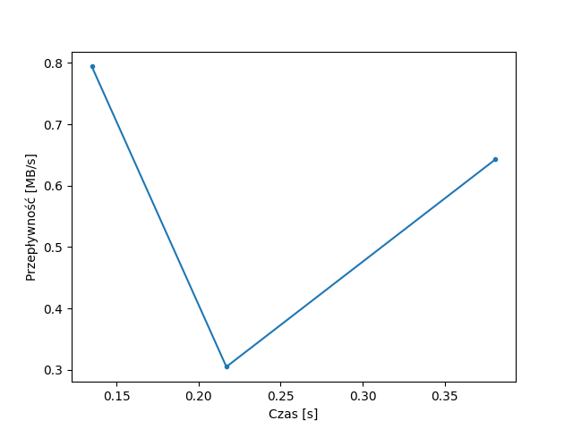
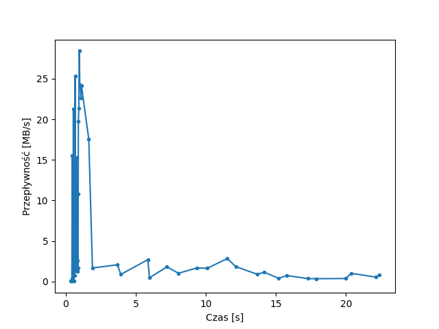

# WMM - Strumieniowanie danych multimedialnych

Bartłomiej Krawczyk, 310774

# 1. Transmisja danych multimedialnych z wykorzystaniem protokołu HTTP


> Jakie komunikaty protokołu HTTP zostały użyte podczas transmisji?

Użyte zostały komunikaty `GET`.

W zapytaniu użyto nagłówka `Range`, aby zadeklarować jaką część pliku chcemy pobrać.

W nagłówku odpowiedzi `Content-Range` znajduje się informacja, która część filmu w formacie mp4 została pobrana.

<div style="page-break-after: always;"></div>

> Oszacować średnią i maksymalną przepływność strumienia danych podczas transmisji pliku multimedialnego




Plik `sintel-trailer-480_med.mp4` pobierany był 3 razy. 

Pierwsze 2 pliki są niewielkimi fragmentami filmu (65kB i 57kB).

Trzeci fragment to pozostała część filmu (6414kB).

**Maksymalna przepływność:**
```
0.794238081 MB/s
```

**Średnia przepływność:**
```
0.638112888 MB/s
```

> Na podstawie analizy kodu źródłowego dokumentu HTML z pkt. 2 określić jakie elementy języka HTML5 zostały wykorzystane do odtworzenia pliku multimedialnego. 

Wykorzystany element to `<video>`.

> Czy umożliwiają one odtwarzanie dowolnych formatów danych multimedialnych?

Element ten wspiera różne formaty oraz kodeki, jednak obsługa danego formatu zależy od wykorzystywanej przeglądarki.

Oznacza to, że nie jesteśmy w stanie odtwarzać **dowolnych** formatów danych multimedialnych.

# 2. Adaptacyjne strumieniowanie danych multimedialnych z wykorzystaniem standardu MPEG-DASH


> Jakie komunikaty protokołu HTTP zostały użyte podczas transmisji

Tutaj podobnie jak wcześniej zostały użyte zapytania `GET`.

<div style="page-break-after: always;"></div>

> Oszacować średnią i maksymalną przepływność strumienia danych podczas transmisji pliku multimedialnego




Tym razem pobrane zostało 58 plików ich sumaryczna wielkość jest około dwa razy większa niż poprzedniego filmu.

**Maksymalna przepływność:**
```
28.41369863 MB/s
```

**Średnia przepływność:**
```
4.936593009 MB/s
```

> Odczytać deskryptor danych multimedialnych (MPD), na jego podstawie określić format danych multimedialnych, liczbę reprezentacji i segmentów.

**stream.mpd:**
```html
<?xml version="1.0" ?>
<MPD mediaPresentationDuration="PT52.208S" minBufferTime="PT2.02S" profiles="urn:mpeg:dash:profile:isoff-live:2011" type="static" xmlns="urn:mpeg:dash:schema:mpd:2011">
  <!-- Created with Bento4 mp4-dash.py, VERSION=1.7.0-611 -->
  <Period>
    <!-- Audio -->
    <AdaptationSet mimeType="audio/mp4" segmentAlignment="true" startWithSAP="1">
      <SegmentTemplate duration="2019" initialization="$RepresentationID$/init.mp4" media="$RepresentationID$/seg-$Number$.m4s" startNumber="1" timescale="1000"/>
      <Representation audioSamplingRate="48000" bandwidth="105957" codecs="mp4a.40.2" id="audio/und">
        <AudioChannelConfiguration schemeIdUri="urn:mpeg:dash:23003:3:audio_channel_configuration:2011" value="2"/>
      </Representation>
    </AdaptationSet>
    <!-- Video -->
    <AdaptationSet maxHeight="480" maxWidth="854" mimeType="video/mp4" minHeight="480" minWidth="854" segmentAlignment="true" startWithSAP="1">
      <SegmentTemplate duration="2019" initialization="$RepresentationID$/init.mp4" media="$RepresentationID$/seg-$Number$.m4s" startNumber="1" timescale="1000"/>
      <Representation bandwidth="434162" codecs="avc1.64001E" frameRate="24" height="480" id="video/1" scanType="progressive" width="854"/>
      <Representation bandwidth="2181291" codecs="avc1.64001E" frameRate="24" height="480" id="video/2" scanType="progressive" width="854"/>
      <Representation bandwidth="4010657" codecs="avc1.64001E" frameRate="24" height="480" id="video/3" scanType="progressive" width="854"/>
    </AdaptationSet>
  </Period>
</MPD>

```

**Format danych multimedialnych:**
```
video/mp4
audio/mp4
```

Wideo jest przetwarzane kodekiem AVC, a dwukanałowe audio kodekiem AAC.

**Liczba reprezentacji:**
```py
video: 3
audio: 1
```

**Liczba segmentów:**
```
26
```

> Na podstawie uzyskanych wyników porównaj analizowane metody strumieniowania danych multimedialnych, określ możliwości ich zastosowania do dystrybucji programów telewizyjnych.

Metoda wykorzystana w pierwszym przykładzie:
- pobiera cały film / jego dużą część przed odtworzeniem
- nie mamy możliwości zmiany jakości odbieranego filmu - w zależności od przepływności naszego łącza
- wymaga całkiem dużego bufora na pobrane części programów
- raczej nie ma zastosowania do dystrybucji telewizyjnych, ponieważ:
  - pobieramy całe programy na raz, programy telewizyjne często są bardzo długie
  - opóźnienie na filmach `na żywo` byłoby bardzo duże
  - w trakcie przesyłania nie jesteśmy w stanie wpływać na jakość

Metoda adaptacyjnego strumieniowania MPEG-DASH:
- film jest podzielony na mniejsze fragmenty
- dostępne jest kilka jakości danych fragmentów, aby dostępna była najlepsza jakość filmu przy naszej aktualnej przepływności
- możemy odtwarzać film fragmentami, nie musimy pobierać całości, żeby zacząć oglądać
- nie wymaga bardzo dużego bufora - możemy ściągać fragmenty dopiero, gdy ich potrzebujemy
- wykorzystanie adaptacyjnego strumieniowania danych ma więcej sensu w dystrybucjach telewizji:
  - długie programy dzielone na fragmenty, aby pobierać jedynie oglądaną część programu
  - filmy `na żywo` mogą być dzielone na fragmenty i streamowane z niewielkim opóźnieniem
  - każdy fragment może być dostępny w różnych jakościach, aby każdy mógł oglądać, nawet przy gorszym zasięgu
