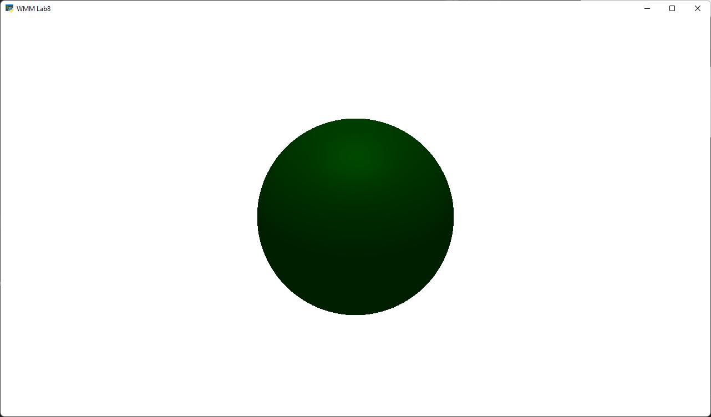

# Wstęp do Multimediów

Laboratorium 8 - Generowanie grafiki z wykorzystaniem popularnej biblioteki graficznej

Bartłomiej Krawczyk, 310774

# Składanie transformacji

Wizualizacja stworzonego robota w innym kolorze niż ten pokazany w instrukcji:


# Cieniowanie

Przyjęte podstawowe wartości:
```py
OBJECT_COLOR = (0.8, 0.8, 0.8)
LIGHT_COLOR = (1, 1, 1)

LIGHT_POSITION = (3, 0, 5)
VIEW_POSITION = (5, 0, 0)

SHININESS = 5
```

```c++
// Surroundings factor
float ambient = 0.6;
// Light diffuse factor
float diffuse = 0.6;
// Reflectivity factor
float specular = 0.3;
```


## Położenie źródła światła

| Położenie  | Zdjęcie                   |
|------------|---------------------------|
| (3, 0, 5)  |  |
| (3, 0, -5) |       |
| (1, 3, 0)  |       |
| (3, -1, 0) |       |

## Różna połyskliwość obiektu

| Połyskliwość | Zdjęcie                   |
|--------------|---------------------------|
| 1            |       |
| 5            |  |
| 20           |      |
| 100          |     |

## Różne kolory obiektu

| Kolor obiektu   | Zdjęcie                   |
|-----------------|---------------------------|
| (0.8, 0.8, 0.8) |  |
| (0.8, 0, 0)     |      |
| (0, 0.8, 0)     |    |
| (0, 0, 0.8)     |     |

## Różne kolory światła


| Kolor światła | Zdjęcie                   |
|---------------|---------------------------|
| (1, 1, 1)     |  |
| (1, 1, 0)     |  |
| (0, 0.3, 0.5) |    |

Aby osiągnąć trochę inne efekty postanowiłem zmienić podstawowy kolor obiektu na:
```py
OBJECT_COLOR = (0.8, 0.2, 0.5)
```

| Kolor światła | Zdjęcie                   |
|---------------|---------------------------|
| (1, 1, 1)     |    |
| (0, 1, 1)     |   |
| (0.3, 1, 0.4) |  |
| (0, 1, 0)     |  |